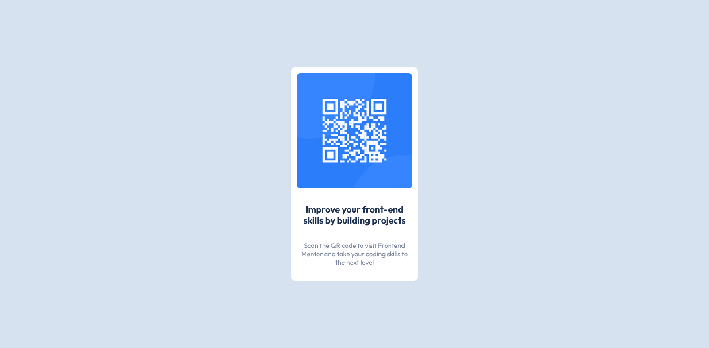

# Frontend Mentor - QR code component solution

This is a solution to the [QR code component challenge on Frontend Mentor](https://www.frontendmentor.io/challenges/qr-code-component-iux_sIO_H). Frontend Mentor challenges help you improve your coding skills by building realistic projects.

## Table of contents

- [Overview](#overview)
  - [Screenshot](#screenshot)
  - [Links](#links)
- [My process](#my-process)
  - [Built with](#built-with)
  - [What I learned](#what-i-learned)
  - [Continued development](#continued-development)
  - [Useful resources](#useful-resources)
- [Author](#author)
- [Acknowledgments](#acknowledgments)

## Overview

### Screenshot

##### Desktop Design Screenshot

##### Mobile Design Screenshot

### Links

- Solution URL: [Add solution URL here](https://your-solution-url.com)
- Live Site URL: [Add live site URL here](https://your-live-site-url.com)

## My process

### Built with

- Semantic HTML5 markup
- CSS custom properties
- Flexbox
- CSS Grid

### What I learned

i learnt to make my website responsive using the css @media property and also to write markdown for my project

### Useful resources

- [The Markdown Guide](https://www.markdownguide.org/) - This website helped me understand how to write some basic markdown for my projects

## Author

- Frontend Mentor - [@isaacohenedanso](https://www.frontendmentor.io/profile/isaacohenedanso)
- Twitter - [@isaacohenedanso](https://www.twitter.com/isaacohenedanso)

**Note: Delete this note and add/remove/edit lines above based on what links you'd like to share.**

## Acknowledgments

thanks to The Markdown Guide for helping me to understand and learn how to write my markdown files
